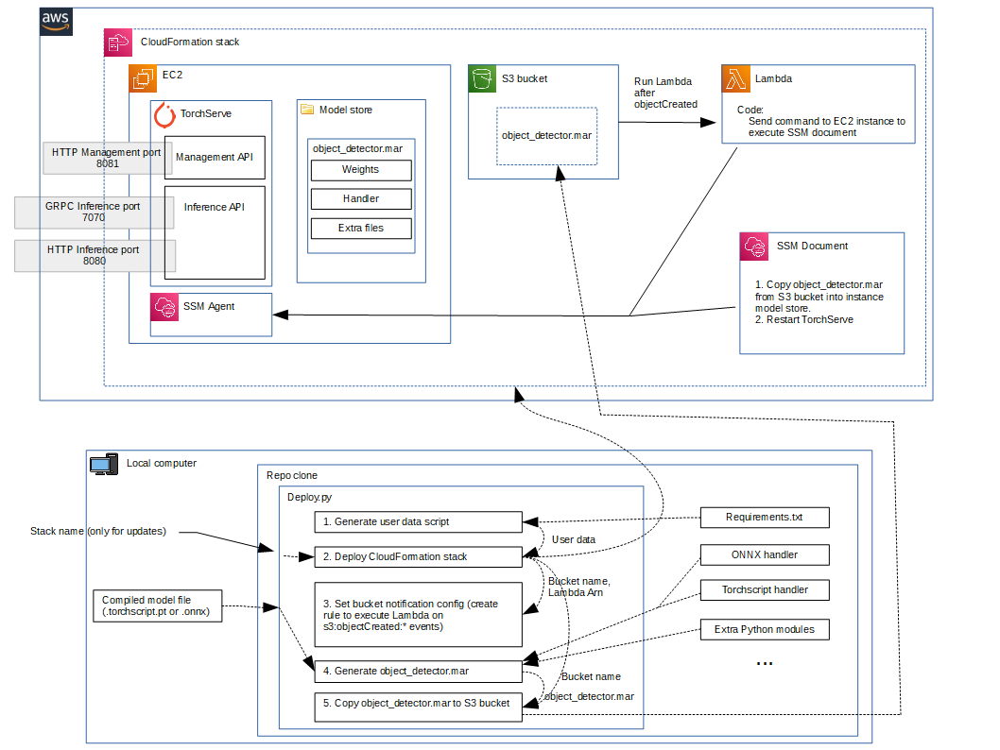

# Deploy to EC2 instance[s]

It includes:
- At least one EC2 instance with a running TorchServe model server.
- (Optional, flag `--asg`): autoscaling group of EC2 instances fronted by an application load balancer and distributed
  across two availability zones.
- Custom VPC.
- gRPC support only for single instance deployment (not passing `--asg` flag).

## Requirements

- AWS CLI should be installed and configured on the computer where you execute the deployment script
- Install the development environment from the project root (server/):

    `pip install --extra-index-url https://download.pytorch.org/whl/cpu -e .[dev]`
    
  If you have any issues regarding compatibility of library versions, install the locked development requirements (the 
  other requirements.txt contains exclusively the packages needed for the EC2 server), from the project root (server/):
  ```
  pip install -r dev-requirements.txt
  ```

## Commands

```
deploy.py [-h] [--stack-name STACK_NAME] [--model-name MODEL_NAME]
          [--test] [--asg] [--instance-type INSTANCE_TYPE]
          model_path
```

- To deploy for the first time:

  `python deploy.py [--asg] <model-path(.torchscript.pt or .onnx)>`

  Include the flag `--asg` to deploy an autoscaling group of EC2 instances fronted by an application load balancer, instead of just a single instance.
  gRPC is not supported for this option, only for a single EC2 instance.

- To deploy modifying an existing infrastructure and avoid creating a new stack, you must pass the name of the existing CloudFormation stack:

  `python deploy.py [--asg] --stack-name <stack-name> <model-path(.torchscript.pt or .onnx)>`

## Infrastructure details


