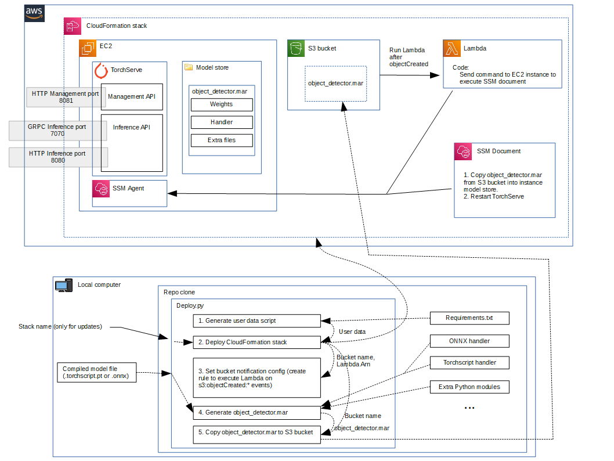

Deploy to EC2

# Requirements

- AWS CLI should be installed and configured on the computer where you execute the deployment script

# Commands

- To deploy for the first time:

  `python deploy.py [--asg] <model-path(.torchscript.pt or .onnx)>`

  Include the flag `--asg` to deploy an autoscaling group of EC2 instances fronted by an application load balancer, instead of just a single instance.

- To deploy modifying an existing infrastructure and avoid creating a new stack, you must pass the name of the existing CloudFormation stack:

  `python deploy.py [--asg] --stack-name <stack-name> <model-path(.torchscript.pt or .onnx)>`

# Infrastructure details

